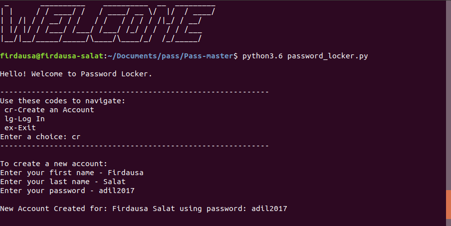
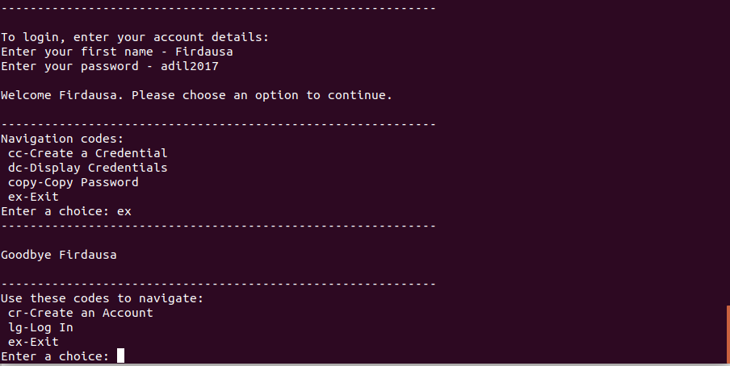

# PASSWORD-LOCKER

## Author
[FIRDAUSA SALAT](http://github.com/firdausa7)

## Description
Password Locker is a terminal run python application that allows users to store their credentials, usernames and passwords of their accounts.

## Screenshot

## Specifications
| Behavior | Input | Output |
| :---------------- | :---------------: | ------------------: |
| Display codes for navigation | **In terminal: $./password_locker.py** | Welcome, choose an option: cr-Create Account, lg-Log In, ex-Exit |
| Display prompt for creating an account | **Enter: cr** | Enter your first name, last name and password |
| Display prompt for login in | **Enter: lg** | Enter your account name and password |
| Display codes for navigation | **Successful login** | Choose an option: cc - Create Credentials, dc - Display Credentials, copy - Copy Credentials, ex - exit |
| Display prompt for creating a credential | **Enter: cc** | Enter the site name, your username and password |
| Display a list of credentials | **Enter: dc** | Prints a list of saved credentials |
| Display prompt for which credential to copy | **Enter: copy** | Enter the site name of the credential you wish to copy. |
| Exit application | **Enter: ex** | Exit the current navigation stage |

## Setup
* python3.6
* pip
* pyperclip

## Installation
* In your terminal:
    $ git clone https://github.com/firdausa7/PASSWORD-LOCKER/
 * cd PASSWORD-LOCKER

## Running the Application
* To run the application, in your terminal:

        $ chmod +x password_locker.py
        $ ./password_locker.py

## Testing the Application
* To run the tests for the class file:

        $ python3.6 user_credentials_test.py

## Technologies Used
* Python3.6
  
  ## Contact
  For any contributions or questions, u can reach me at [Firdausa.salat@gmail.com]

## License
MIT &copy;2019 [FIRDAUSA SALAT](https://github.com/firdausa7/)
